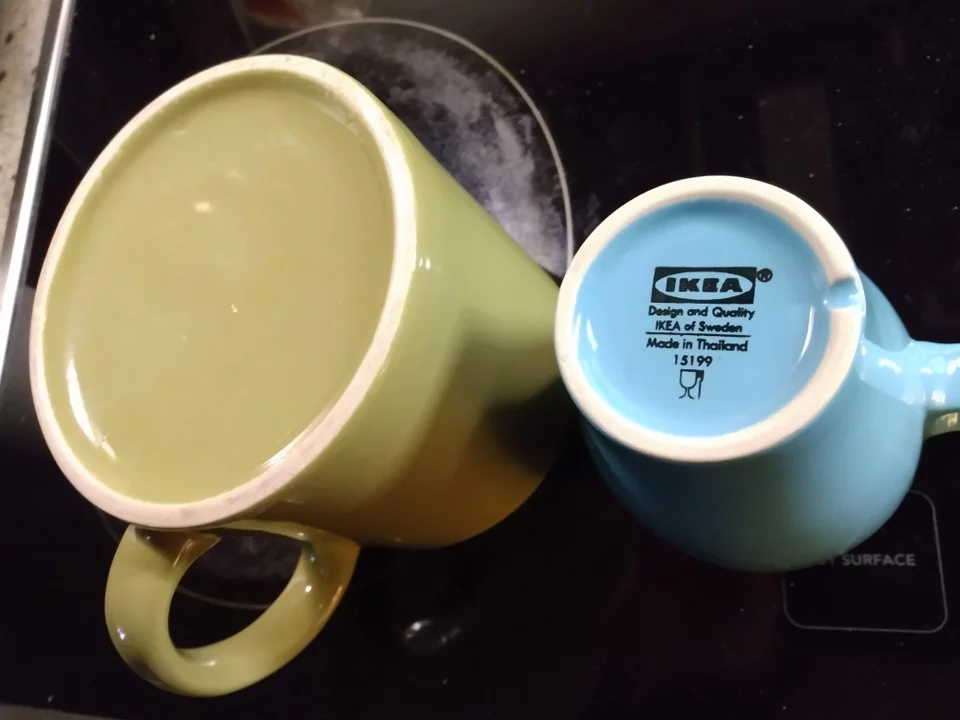

# Coordinating With Cups

“Language” is the solution to a coordination problem. 

1. You put a mug and a glass in front of me, and want to know which I want. I can point to the one I want.$^1$
2. You’re going to the store to buy me a cup for my birthday. You want to know if I’d like a mug or glass, you’ll pick something nice out for me. We have have abstract classes of things to make this possible. Therefore, I say: “I want a mug.”
3. You’re going to the store to buy me something for my birthday and you want to know what kind of thing I’d want—I want a cup, of course, but I don’t care if it’s a mug or glass or even if there’s a novelty cup that’s hard to describe. I need an abstract class that I know implies the purpose and basic usability parameters, and since it’s a common niche, we’ve developed one. Therefore, I say: “I want a cup.”
4. You’re going to the store to buy me something for my birthday and you want to know what would make me happy. I don’t actually know, but I know some abstract properties of it like I want to to be uniquely related to my relationship with you. I can explain this to you, because the idea of a “uniqueness” and a “relationship” allow me to describe schemas that you can fill in with your knowledge of our shared narrative. Therefore, I say: “I dunno, but I want something that’s very ‘us’.” 
You pick me up a cup, because we’re always drinking hot cocoa together, 10/10 great friend.
5. *I* have a mug and glass and I want to know which one you want. I want to present the question to you, such that you know to point to one of them. Therefore, I say “Point to the one you want.” 
You can resolve “one” to referring to the two cups as a class, because we’ve been socialized into a shared notion of saliency that makes the class of objects I’m considering clear, once I’ve specified that I want you to specify a discrete object with the term “one” and made it clear it’s close by in your field of vision with “point”.
You point to the mug.
6. *I* have a mug and glass and I want to know which one you want. I want to present the question to you, such that you know to point to one of them. Therefore, I say “Point to the one you want.” 
You can resolve “one” to the two cups, because we’ve been socialized into a shared notion of saliency that makes the class of objects I’m considering clear, once I’ve specified that I want you to specify a discrete object with the term “one” and made it clear it’s close by in your field of vision with “point”.
You point to me, playing off the “contract” that what I wasn’t in the group of objects I was trying to get you to select me from. This is a “joke”, it breaks the expected contract to defamiliarize people into accepting information that’s out of the expectation of normal interactions.
We fall in love, start a family, and our heriditary empire conquers the world.
7. *I* want to do something for your birthday, but I don’t want to let you in on the fact that I’m poking around for what you’d like. I ask you what you think of some novelty mugs I found on Instagram. You are capable of giving preferences *without a specific use case in mind.* I may not even know whether you’re thinking of the mug as more decorative or functional—but since you’re capable of communicating abstracted preferences I can hide information for you, for your own good, because you love surprises.
8. *I* work at a mug factory and my job is to figure out if a mug is defective as it goes by on the assembly line. My employer wants to make sure that I pay special attention to the *grooves* on the bottom of the mugs, that are meant to allow water to drain in the dishwasher. I’ve never heard of a “groove” except in music, but I’m familiar enough with language to know that words can have multiple unconnected senses, so instead of detailing my clearly incoherent interpretation of “groove” or explaining it, I’m able to simply ask “What’s a groove?” and my boss picks up a mug and shows me, by pointing to the salient part.
    

    
9. I’m a mug designer and I want to make the top of mug a certain color. In order to communicate with the draftstmen who will communicate with the manufacturers, I find myself having to point a lot, so I repurpose the word “lip” as if the opening of the mug was a mouth to mean “the top region of a mug’s opening” in metaphor to the human mouth and lips.
10. New type of guy drops in 3000 BC: guy who doesn’t want to burn his hand holding the water he’s boiled to sanitize it. He adds a handle to a normal metal drinking cup. People ask why he made his cup that way when they come to his house. He says “I was tired of burning my hands when I drink hot water.” Everyone has enough experience of the physics of heat to understand that holding a hot cup is painful and dangerous, and they can simulate the heat not transferring to the rest of the mug, because this brand new type of guy was capable of pointing them to the intention through language.

Language solve a coordination problem: “How do I explain something with enough detail to cooperate in a given situation without explaining the entire universe?”

---

1. Wait, how do you understand pointing? Turns out “shared attention” might be a biological primitive that humans have more than most other creatures—see Michael Tomasello’s work for more.