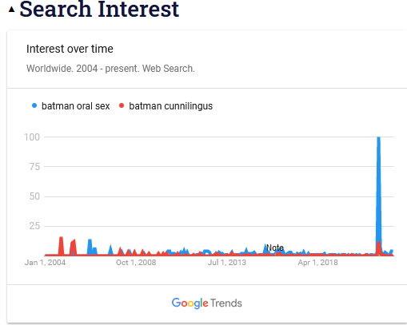

Date: 2022-03-29
Tags: machine learning, context, text generation
# Catwoman Leaving Batman For Jar Jar Binks Because Of His Implied Proficiency At Oral Sex As A Cautionary Tale for Artificial General Intelligence

Machine learning techniques are getting a lot better at generating reams of plausible sounding text. Since human beings frequently use text to communicate, it’s easy to interpret this as “we’re getting much closer to artificial intelligence capable of human communication.” But human communication relies on a lot more than textual back-and-forth, and I think it’s useful sometimes to flip your thinking the other way around. Instead of focusing on what AI has done that seems very human, focus on what humans do that seems very hard for the AI to replicate. 

To that end, I want to share a tweet:

[https://twitter.com/FakeEyes22/status/1404643613645099011](https://twitter.com/FakeEyes22/status/1404643613645099011)

This tweet had over 8000 likes at time of writing. It was communicating a message, and that message was clearly received and enjoyed by thousands of people. But it was a message for a very specific time and shared context, so I need to start by explaining that. On June 14th, 2021, an Variety interview went viral on Twitter because of this quote:

> **Justin Halpern:**
A perfect example of that is in this  third season of ‘Harley’ [when] we had a moment where Batman was going down on Catwoman. And DC was like, "You can’t do that. You absolutely cannot do that." They’re like, "Heroes don’t do that." So, we said, "Are you saying heroes are just selfish lovers?" They were like, "No, it’s  that we sell consumer toys for heroes. It’s hard to sell a toy if Batman is also going down on someone."
> 

This [KnowYourMeme](https://knowyourmeme.com/memes/events/batman-oral-sex-scene-removal) page has more context. Knowing that backstory might help you get the image. If not, then here’s a belabored explanation of the joke:

> Catwoman is walking away hand in hand with Jar Jar Binks. Catwoman is waving farewell with her other hand. Jar Jar has an extremely smug expression. Batman is standing alone, looking distraught with his hands out in an incredulous position. This is funny because Jar Jar Binks has an extremely long tongue. The implication of this picture is that Catwoman is dissatisfied by Batman’s unwillingness to perform oral sex, and is going to go out with Jar Jar Binks instead so she can receive superlative oral sex instead of none.
> 

There’s a reason this image went viral while my explanation wasn’t actually that funny. The moment of recognition *is* the joke, and the small touches like Jar Jar’s sassy gait add a lot of color that the text doesn’t. All the same, this is communication. If an artificial general intelligence is going to reach superhuman levels, then it should be able to “get the joke” in the way that thousands of humans did. But when you look at what it takes to get this joke, it’s a pretty tall order.

## Prerequisite 1: Extremely Recent Context

[https://twitter.com/maplecocaine/status/1080665226410889217?lang=en](https://twitter.com/maplecocaine/status/1080665226410889217?lang=en)

Many machine learning models work by having a team of workers hand-annotate a large volume of “training data”, then use that to train the model to look at new things. This works when you’re dealing with objects that are reasonably stable throughout time. Predicting success on Twitter, with a new main character every day, is a different matter entirely. A classifier guessing whether this tweet would dramatically succeed or get no likes should guess “no likes” for June 13th 2021, and every single prior day, and then dramatically change it’s mind after seeing the sudden flood of batman oral sex content.

So, your model has to be updating on a timescale of ideally minutes, and hours at absolute most. Any learning loop slower than that is unable to handle human social communication.

## Prerequisite 2: Recognition of Shared Fictional Information

Batman, Catwoman, and Jar Jar Binks aren’t real. But Batman and Catwoman aren’t real *together,* in the same fictional universe. Because there are a lot of different Batman stories, it’s not precisely a **fact** that Batman and Catwoman are “dating”. But clearly, a picture setting up the narrative “Catwoman expects oral sex from Batman and isn’t getting it” is *reasonable* in a way that wouldn’t be true if Batman was replaced with Santa Claus. So, your model has to be plugged in to the shared fictional canon, and know that “romantic relationships where someone could expect oral sex from their partner” is a classifier that can be fairly applied to Catwoman and Batman. Any model that doesn’t incorporate shared fictional canon is unable to handle human social communication.

## Prerequisite 3: Recognition of Implied Physicality from Fiction

When I google “Jar Jar Binks tongue length”, my top result is [this post from ScreenRant:](https://screenrant.com/star-wars-jar-jar-binks-anatomy-trivia/)

> Another distinctive trait of the Gungans is their long, agile tongues that seem to have minds of their own. Given that Gungans have an insatiable appetite for everything from shellfish and slimy bugs to a dessert that takes four people to eat, it’s a good thing that they have one-meter-long tongues (over 3 feet) to help grab any and all food in their vicinity.
> 

A neural net trained on a lot of articles from the internet might get lucky and know that Jar Jar Binks has a long tongue because it ingested this article. But I’m certain that almost none of the thousands of people who liked this tweet have read this article. Most people who know that Jar Jar Binks has a long tongue know it because they saw it in the movie. They wouldn’t come up with the “over 3 feet” figure themselves, but would happily tell you “Jar Jar’s tongue? It’s real long.” 

Your model has to have “seen” Star Wars Episode 1: The Phantom Menace to know this - you can’t count on someone at ScreenRant encoding everything that ever happens in a movie into a textual form. It also has to know the connection between tongues and oral sex, but interestingly, not in a strictly simulationist way. The claim here isn’t literally that a 3 foot tongue would make you twelve times better at oral sex than the usual 3 inch human tongue in some machine-measurable way that could be proven via simulation. It’s more of a loosey-goosey “You use tongues for oral sex, Jar Jar Binks has a superlative tongue, and so a claim that Jar Jar Binks gives superlative oral sex is reasonably in-bounds for the purposes of telling a joke.” Any model that can’t watch a movie and map what it sees to a concept of physical reality - but not a strict simulation!- is unable to handle human social communication.

## Prerequisite 4: Emotional And Positional Interpretations of Inanimate Objects

Let me repost my over-explaining of the joke, but this time, remove anything emotional or positional.

> Catwoman, Batman, and Jar Jar Binks are in a picture together. This is funny because Jar Jar Binks has an extremely long tongue. The implication of this picture is that Catwoman is dissatisfied by Batman’s unwillingness to perform oral sex, and is going to go out with Jar Jar Binks instead so she can receive superlative oral sex instead of none.

Do you think the first sentence implies the rest? Of course not. You have to be able to see that Catwoman and Jar Jar Binks are standing *together*, and that Batman is *alone.* It’s funny because Catwoman looks *flippant* and Jar Jar looks *smug* and Batman looks *distraught.* Humans constantly write little narratives to themselves looking at inanimate objects, so a model that’s able to reach superhuman levels of understanding has to be able to write those narratives as well. A model that can’t write social stories based on the position and implied emotion of inanimate objects is unable to handle human social communication.

Words are cool and I like writing with them. Machine learning is getting better at using words, and good for the machines. But even if we figure out how to have a pile of statistical correlations look at Shakespeare *so hard* that it can write more Shakespeare, that’s only making progress for one particular sub-case of one particular facet of the vast and wild world of human social communication. It’s not making any progress whatsoever towards solving any of the above problems. If you’re imagining societal or existential risk from an AI with superhuman powers of communication, you’re imagining that *all* of these problems are going to get solved. Otherwise, you’ve just got a guy that can write a good tweet sometimes but has no real theory of mind for which tweets will do well in advance - and buddy, we’ve got those guys already.
